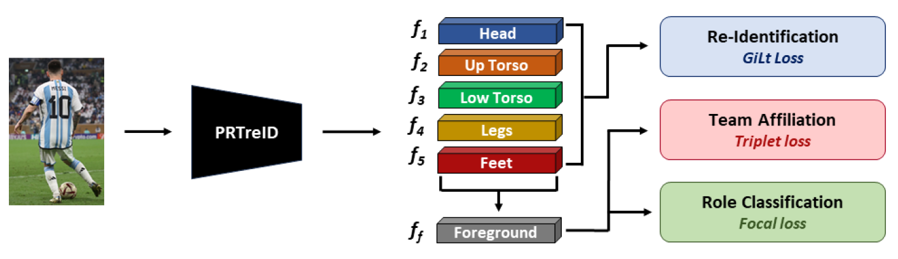

<!-- TODO

-->


# PRTreID

**Multi-task Learning for Joint Re-identification, Team Affiliation, and Role Classification for Sports Visual Tracking** 

[[Paper](https://arxiv.org/abs/2401.09942)]

[](https://arxiv.org/abs/2401.09942) [](https://firstdonoharm.dev/version/3/0/law-media-mil-soc-sv.html)

>**[Multi-task Learning for Joint Re-identification, Team Affiliation, and Role Classification for Sports Visual Tracking, MMSports'23](https://arxiv.org/abs/2401.09942)**
>
>Amir M. Mansourian*, Vladimir Somers*, Christophe De Vleeschouwer, Shohreh Kasaei
>
>[*arxiv 2401.09942*](https://arxiv.org/abs/2401.09942)
>



PRTreID is based on "[BPBReID: Body Part-based (Occluded) Re-Identification](https://github.com/VlSomers/bpbreid)": a lot of relevant information can be found in the original repository.
This PRTreID repository will be updated soon with detailed instructions on how to run the model and download the weights.
Compared to the original BPBreID repository, a new head was added to the [main model](prtreid/models/bpbreid.py) to predict roles, and [two new training objectives](prtreid/engine/image/part_based_engine.py) were added to train the model on team affiliation and role classification.
PRTreID was tested on the [SoccerNet-GSR](https://github.com/SoccerNet/sn-gamestate) and [SoccerNet-Tracking](https://github.com/SoccerNet/sn-tracking) datasets.
To train/run PRTreID on SoccerNet, please have a look at [this repository](https://github.com/SoccerNet/sn-gamestate): a [dataloader](https://github.com/SoccerNet/sn-gamestate/blob/main/sn_gamestate/reid/prtreid_dataset.py) is provided to turn the SoccerNet dataset into a Torchreid compatible dataset, to be used by this repository for training PRTreID.
If you need to run PRTreID, please install [SoccerNet-GSR](https://github.com/SoccerNet/sn-gamestate), carefully read the instructions on how to use the codebase, and enable PRTreID training by setting the "training_enabled" to True inside [prtreid.yaml](https://github.com/SoccerNet/sn-gamestate/blob/main/sn_gamestate/configs/modules/reid/prtreid.yaml).
Once SoccerNet-GSR is run with the above config enabled, a reid dataset will be automatically extracted from the soccernet tracking dataset, and PRTreID will be subsequently trained on the generated dataset.
If you need to change any training config, please do so inside [prtreid.yaml](https://github.com/SoccerNet/sn-gamestate/blob/main/sn_gamestate/configs/modules/reid/prtreid.yaml): this .yaml file contains Torchreid compatible configurations, as described [here](https://github.com/KaiyangZhou/deep-person-reid) and [here](https://github.com/VlSomers/bpbreid).
In practice, [prtreid.yaml](https://github.com/SoccerNet/sn-gamestate/blob/main/sn_gamestate/configs/modules/reid/prtreid.yaml) is a mirror of the config defined in [default_config.py](prtreid/scripts/default_config.py).
The current description and code will be improved soon to ease installation, please follow the repository to stay tuned.
If you have any questions or need further guidance to install PRTreID, feel free to open a GitHub issue.


## News
- [2024.01.1] Code release


## Citation
If you use this repository for your research or wish to refer to our method [PRTreID](https://arxiv.org/abs/2401.09942), please use the following BibTeX entry:
```
@inproceedings{Mansourian2023Multitask,
	title = {Multi-task Learning for Joint Re-identification, Team Affiliation, and Role Classification for Sports Visual Tracking},
	author = {Mansourian, Amir M. and Somers, Vladimir and De Vleeschouwer, Christophe and Kasaei, Shohreh},
	booktitle = mmsports,
	shortjournalproceedings = {Proc. 6th Int. Work. Multimedia Content Anal. Sports},
	pages = {103–112},
	month = Oct,
	year = {2023},
	publisher = {ACM},
	address = city-ottawa,
	keywords = {SoccerNet, Bottom-up, ARTHuS, Team affiliation, Role classification},
	doi = {10.1145/3606038.3616172},
	url = {https://doi.org/10.1145/3606038.3616172}
}
```

## Acknowledgement
This codebase is a fork from [BPBreID](https://github.com/VlSomers/bpbreid)


